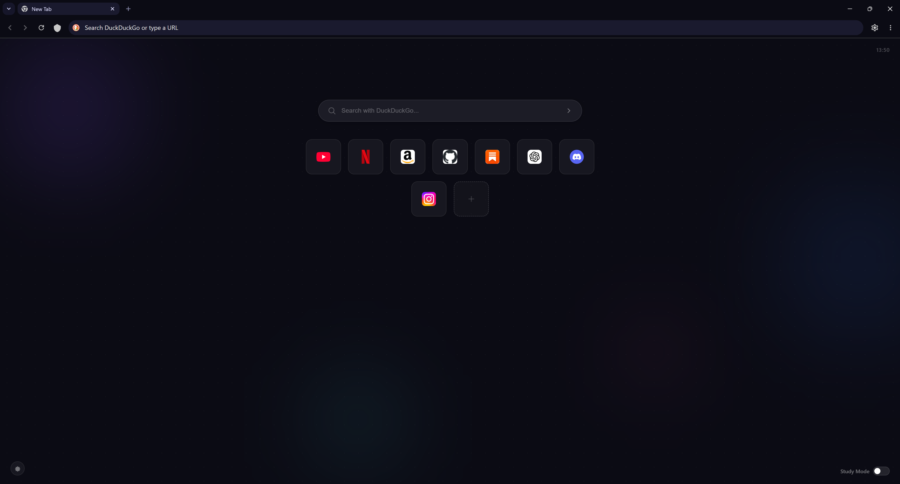

#  Neovex

Neovex is a Chromium-based browser focused on minimalism, performance, privacy, and a cleaner browsing experience.

---

## Features

- Lightweight and minimal design
- Built-in ad blocker
- Enhanced private browsing
- Tor integration for private sessions
- Study mode and focus tools
- Performance-focused optimizations

---

## Screenshots





---

## Development Setup

Neovex currently contains modified source files and custom additions built on top of Chromium.

### Get Chromium

```bash
fetch chromium
cd src
```

### Clone Neovex

```bash
git clone https://github.com/pahal-desai/Neovex.git neovex
```

### Apply Neovex modifications

Copy and replace the files from the Neovex repository into the Chromium source directory.

### Generate build files

```bash
gn gen out/Default
```

### Build

```bash
autoninja -C out/Default chrome
```

### Run

```bash
out/Default/chrome.exe
```

---

## Project Structure

```
Neovex/
├── chrome/
├── components/
├── ui/
├── third_party/
└── custom browser features
```

---

## Contributing

Contributions, suggestions, and feedback are welcome.

If you discover bugs or UI issues:

- Open an issue
- Create a pull request
- Share feedback

---

## Disclaimer

Neovex is an independent project and is not affiliated with Google or the Chromium project.

Chromium is used as the browser engine.

---

## License

This project follows Chromium's applicable open-source licensing requirements.